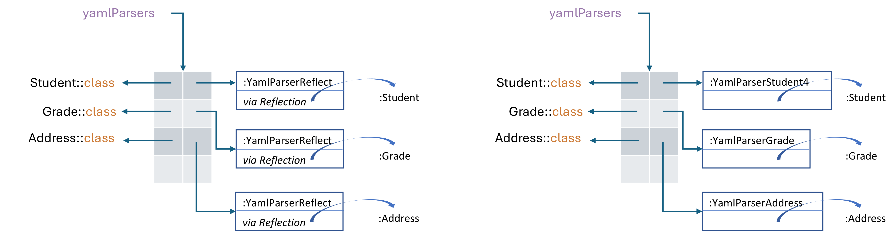

## yamlify - YAML Parser

YAML Parser through Reflection API and bytecode generation for JVM, 
with both eager and lazy sequences processing.

## Assignments

1. Published 20-3-2024 **DEADLINE: 06-4-2024**
1. Published 20-3-2024 **DEADLINE: 27-4-2024**
1. Published 05-5-2024 **DEADLINE: 25-5-2024**

***

Use this project as the template for your implementation of a YAML parser.

Throughout the semester, you will implement various approaches to a basic YAML
parser, adhering to specific aspects of the [YAML version 1.2.2 specification](https://yaml.org/spec/1.2.2).
It's important to note that these implementations will have certain limitations:
* **No support** either block string nor line folding with `|` or `>`.
* **No support** of _flow styles_
* Type-safe ONLY with constructor injection. 
* No support of mutable properties injection.

Namely, examples 2.5 and 2.6 of [YAML 1.2.2](https://yaml.org/spec/1.2.2)
denoting the use of _flow styles_ should **NOT** be supported by your implementation
of the YAML parser.

## Assignment 1 - Types at runtime and Reflection API

### 1.1

You are required to implement the YAML parsing algorithm in the missing methods
of the `AbstractYamlParser` class. 
Additionally, you need to implement the `newInstance` method of the
`YamlParserReflect` class. 
It's important to note that methods of `AbstractYamlParser` will invoke the hook
method `newInstance`, passing the necessary `Map<String, Any>`.
Ensure that your implementation successfully passes the provided unit tests.

### 1.2

Properties of the domain class should be able to have names different from
those used in the YAML representation.
For example, a property in YAML may have the name `city of birth`, while in
Kotlin, it might be named `from`.
To address the mapping between properties with distinct names, implement a
`YamlArg` annotation that can be used on the parameters of a domain class
constructor, indicating the corresponding name in YAML (e.g., `@YamlArg("city
of birth")`).
Modify `YamlParserReflect` to support the specified behavior and **validate it with unit tests.**

### 1.3

The `YamlParserReflect` should support extensibility with custom parsers
provided by the domain class.
For instance, when dealing with a YAML mapping like `birth: 2004-05-26`, you
might want to parse the value as an instance of `LocalDate`. 
To achieve this, you can annotate the corresponding constructor argument as
follows:

```kotlin
class Student(..., @YamlConvert(YamlToDate::class) val birth: LocalDate, ...)
```

In this example, `YamlToDate` is a class provided by the same developer that
implements the domain class `Student`.

Adjust your implementation of `YamlParserReflect` to seamlessly integrate any
parser provided by its clients for any data type.
A parser should be a class that offers a function taking a `String` argument and
returning an `Object`.

Validate your implementation with the provided example of the `birth` property
and create another example to showcase your approach with a different property
type.

### Usage of JMH

To run the benchmark on you local machine just run:

```
./gradlew jmhJar
```

And then:

```
java -jar yamlify-bench/build/libs/yamlify-bench-jmh.jar -i 4 -wi 4 -f 1 -r 2 -w 2 -tu ms
```

* `-i`  4 iterations
* `-wi` 4 warmup iterations
* `-f`  1 fork
* `-r`  2 run each iteration for 2 seconds
* `-w`  2 run each warmup iteration for 2 seconds.
* `-tu` ms time unit milliseconds 

## Assigment 2

Following up on Assignment 1 developed in the **yamlify** library, it is
intended to complete the implementation of the `YamlParserCojen` with the same
behavior as `YamlParserReflect`, but that DOES NOT use reflection to instantiate
the domain class (e.g. `Student`, `Address`, etc).
Note that reflection will continue to be used to read metadata, only ceasing to
be used in operations such as `ctor.callBy(...)`.
The instantiation of a domain class will now be done directly based on code
generated at runtime through the [Cojen Maker](https://github.com/cojen/Maker).

Using JMH in the `yamlify-jmh` project, compare the throughput of the different
approaches for parsing domain classes, namely the baseline, reflect, and Cojen
approaches.
**Include a Markdown report file in your repository with the results and analysis.**


The following Figure presents an example of the use of `YamlParserReflect` from
Assignment 1, where each instance of `YamlParserReflect` is associated with an
instance of `KClass` to parse a specific domain class.
Now, in Assignment 2, you will have a different YAML parser class (e.g.,
`YamlParserStudent4`, `YamlParserAddress3`, etc.) for each domain class, rather
than using the same type of parser for all classes (i.e. `YamlParserReflect`).
These parsers are generated at runtime (i.e., dynamically) with the support of
the Cojen Maker.
The suffix number in the class name indicates the number of parameters of the
constructor used in the instantiation of the domain class.

